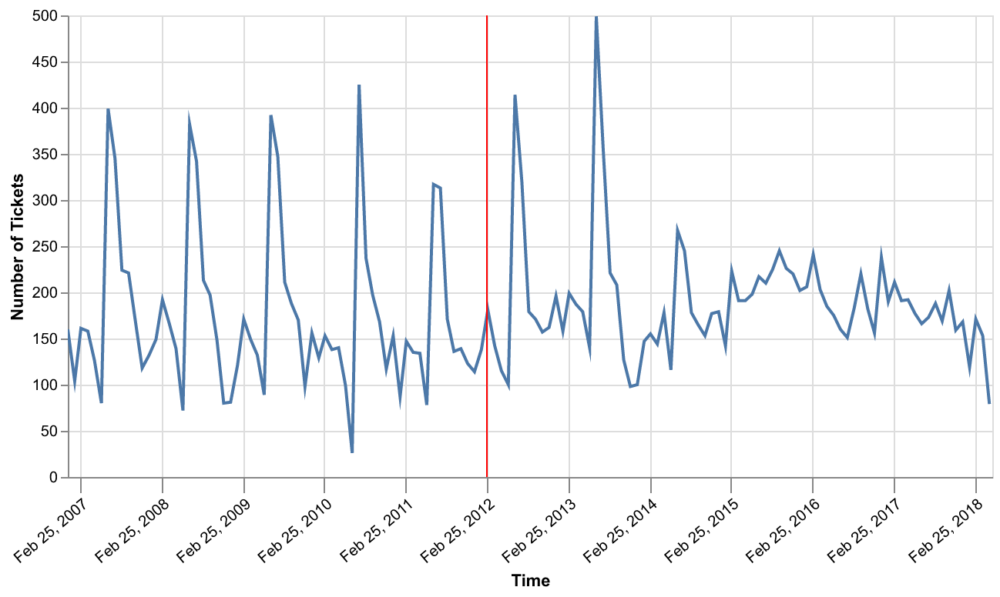
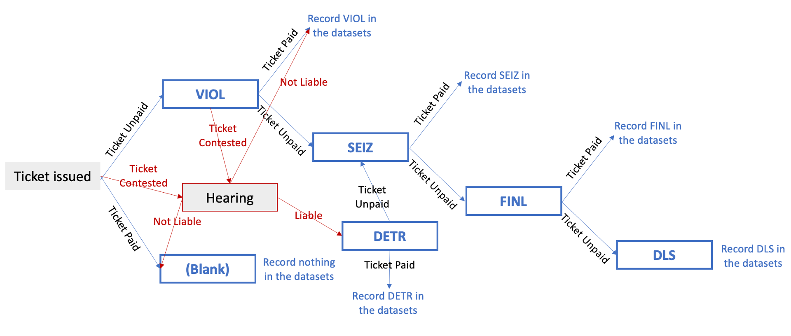
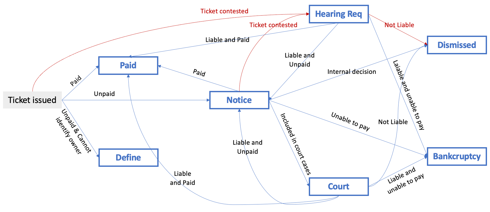
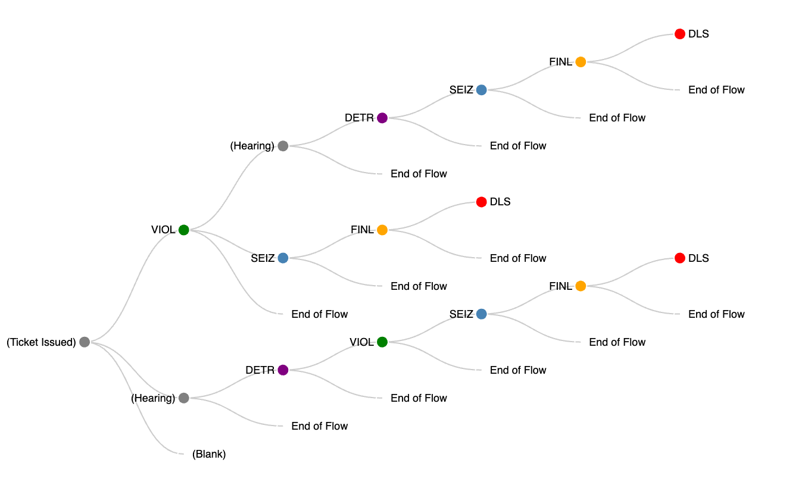

1. This submission is my work alone and complies with the 30538 integrity policy. SW  
2. I have uploaded the names of anyone I worked with on the problem set **[here](https://docs.google.com/forms/d/1-zzHx762odGlpVWtgdIC55vqF-j3gqdAp6Pno1rIGK0/edit)**. SW  
3. Late coins used this pset: 1. Late coins left after submission: 3  

```{python}
# Set up
import altair as alt
alt.renderers.enable("png")
import pandas as pd
import numpy as np
```

# Data Cleaning

```{python}
# Read in the data
path = ("/Users/wangshiying/Documents/71_Python_Programming_II/student30538_new/"
"problem_sets/ps2/data/parking_tickets_one_percent.csv")
df = pd.read_csv(path)
```

## 1.
```{python}
# Define the function
def count_na(dataframe):
    """ Count the number of NAs in each column """
    number_na = dataframe.isna().sum()
    result = pd.DataFrame({
        "Variable": number_na.index,
        "Number_of_NAs": number_na.values
    })
    return result

# Test the function
df_test = pd.DataFrame({
    "A": [0, 2, 3, np.nan, 4, 5],
    "B": [6, np.nan, np.nan, 7, np.nan, 8],
    "C": ["good", "moderate", "mediocre", np.nan, np.nan, "bad"]
})
df_test_result = count_na(df_test)

# Show the test result
df_expected_result = pd.DataFrame({
    "Variable": ["A", "B", "C"],
    "Number_of_NAs": [1, 3, 2]
})
if df_test_result.equals(df_expected_result):
    print("Test result: The function works well.")
else:
    print("Test result: The function doesn't work.")
```

If the function works well, we can proceed to report the results applied to the parking tickets dataframe as following:
```{python}
count_na(df)
```

## 2.
`hearing_disposition`, `notice_level`, and `zipcode` are missing much more frequently than others.  

- **`hearing_disposition`**: This field is missing in 90% of cases because most tickets are not contested. A hearing is only held if the motorist disputes the ticket, which is rare, resulting in most values being blank.  
- **`notice_level`**: Notices are not always sent, especially for newly issued tickets, so missing data here likely reflects tickets that haven't reached the stage where notices are necessary (e.g., if no payment or collections action is pending).  
- **`zipcode`**: Vehicle registration data might be incomplete if the city cannot easily access the vehicle's registration information or if the ticket is issued to non-local drivers.

## 3.
From other articles on ProPublica, the increase in the dollar amount of the ticket might happen in 2012.
```{python}
# Filter the records of missing city sticker
df_missing_sticker = df[df["violation_description"].str.contains("NO CITY STICKER")]

# Show the violation codes in different years
df_missing_sticker["issue_date"] = pd.to_datetime(df_missing_sticker["issue_date"])
df_missing_sticker["year"] = df_missing_sticker["issue_date"].dt.year
violation_code = df_missing_sticker.groupby(["year", "violation_code", "violation_description"]).size()
print(violation_code)
```

The year of change of the violation code aligns with ProPublica's articles.  
Therefore, if ignore the extremely rare cases, we can identify that the old violation code is **0964125**, and the new violation code is **0964125B** for vehicles under/equal to 16,000 lbs and **0964125C** for vehicles over 16,000 lbs.  
The latter one (**0964125C**) is relatively rare, so we may ignore it in the following analysis.

## 4.
```{python}
# Ignore the rare cases under violation code 0976170 and 0964125C
df_missing_sticker = df_missing_sticker.loc[df_missing_sticker["violation_code"].isin(["0964125", "0964125B"])]

# Show the pattern in the cost of initial offense
df_missing_sticker.groupby("violation_code")["fine_level1_amount"].describe()
```

From the table, we can learn that the cost of an initial offense under 0964125 is always $120, and the cost under 0964125B is always $200.

# Revenue increase from "missing city sticker" tickets
## 1.
```{python}
# Create a new value for violation codes that combines the old and the new ones into "0000001"
df["violation_code"] = df["violation_code"].replace(["0964125", "0964125B"], "0000001")

# Collapse the data to capture its number by month
df["issue_date"] = pd.to_datetime(df["issue_date"])
monthly_missing_count = (
    df[df["violation_code"] == "0000001"]
    .groupby(df["issue_date"].dt.to_period("M"))
    .size()
    .reset_index(name="tickets_number")
)

# Plot the number of tickets over time
monthly_missing_count["issue_date"] = monthly_missing_count["issue_date"].astype(str)
alt.Chart(monthly_missing_count).mark_line().encode(
    alt.X("issue_date:O", title="Time",
    axis=alt.Axis(
        values=["2007-01", "2008-01", "2009-01", "2010-01", "2011-01", "2012-01", "2013-01", "2014-01", "2015-01", "2016-01", "2017-01", "2018-01"],
        labelAngle=-40
    )),
    alt.Y("tickets_number:Q", title="Number of Tickets")
).properties(
    width=600,
    height=300
)
```


## 2.
Firstly, we want to find out the specific date of price increase.
```{python}
filtered_df = df[(df["violation_code"] == "0000001") & (df["fine_level1_amount"] == 200)]
filtered_df["issue_date"].iloc[0]
```

Therefore, the date of price increase is 2012-02-25. We can then label it on the chart. To do this, I referred to online sources from the pages [TimeUnit Transform](https://altair-viz.github.io/user_guide/transform/timeunit.html) and [Adjusting axis labels](https://altair-viz.github.io/user_guide/customization.html#adjusting-axis-labels).

```{python}
filtered_df = df[df["violation_code"] == "0000001"]

# Plot the line
lines = alt.Chart(filtered_df).mark_line().encode(
    alt.X("yearmonth(issue_date):T"),
    alt.Y("count():Q")
).properties(
    width=600,
    height=300
)

# Plot the label layer
label_layer = alt.Chart(filtered_df).mark_line(color="transparent").encode(
    alt.X(
        "yearmonthdate(issue_date):T", title="Time",
        axis=alt.Axis(
            labelAngle=-40,
            values=["2007-02-26", "2008-02-26", "2009-02-26", "2010-02-26", "2011-02-26", "2012-02-26", "2013-02-26", "2014-02-26", "2015-02-26", "2016-02-26", "2017-02-26", "2018-02-26"],
            tickSize=10
            )
    ),
    alt.Y("count():Q", title="Number of Tickets")
).properties(
    width=600,
    height=300
)

# Plot the vertical line highlighting the specific date
highlighted_date_df = pd.DataFrame({"date": [pd.to_datetime("2012-02-26")]})
rule = alt.Chart(highlighted_date_df).mark_rule(color="red").encode(
    alt.X("date:T")
)

# Put those layers together
chart_1 = alt.layer(label_layer, lines, rule).interactive()
chart_1.save("chart_1.png", scale_factor=2) # I was unable to use "lines + rule" to directly show the picture on the pdf, and "alt.layer()" is not working either. So I saved and inserted the chart here.
```


## 3.
```{python}
# Filter out the data from 2011
filtered_df_2011 = filtered_df[pd.to_datetime(filtered_df["issue_date"]).dt.year == 2011]
number_tickets_2011 = filtered_df_2011.shape[0]
print(f"The number of tickets issued in one year is approximately {number_tickets_2011}.")
```
The revenue increase for a single ticket is $\$200 - \$120 = \$80$, so the revenue increase calculated based on this sample should be $\$80 * 1933 = \$154,640$.  
Because this is a one percent sample, the estimated revenue increase should be $\$154,640 * 100 = \$15,464,000$.

## 4.
Firstly, we calculate for the year before price increase.
```{python}
number_paid_2011 = filtered_df_2011[filtered_df_2011["ticket_queue"] == "Paid"].shape[0]
repayment_2011 = number_paid_2011 / number_tickets_2011
print(f"The repayment rate before price increase is {repayment_2011}.")
```
Secondly, we calculate for the year after price increase.
```{python}
# Filter out the data from 2013
filtered_df_2013 = filtered_df[pd.to_datetime(filtered_df["issue_date"]).dt.year == 2013]

# Calculate the total amount of tickets issued
number_tickets_2013 = filtered_df_2013.shape[0]
# Caluculate the number of tickets paid
number_paid_2013 = filtered_df_2013[filtered_df_2013["ticket_queue"] == "Paid"].shape[0]

# Calculate the repayment rate
repayment_2013 = number_paid_2013 / number_tickets_2013
print(f"The repayment rate after price increase is {repayment_2013}.")
```
Therefore, we can learn that the repayment rate has dropped from approximately **53.91%** to approximately **40.59%**.  
If the number of tickets issued is unchaged, we can calculate the change in revenue as below:
```{python}
number_tickets_2011 * (repayment_2013 * 200 - repayment_2011 * 120)
```
Therefore, the revenue increase calculated based on this sample should be approximately $31889.1780.  
Because this is a one percent sample, the estimated revenue increase should be $\$31889.1780 * 100 = \$3,188,917.80$. This is far below our expectation in **Q3**.

## 5.
```{python}
filtered_df["is_paid"] = filtered_df["ticket_queue"].apply(lambda x: 1 if x == "Paid" else 0)

# Aggregate data to monthly level
filtered_df["month"] = filtered_df["issue_date"].dt.to_period("M")
monthly_filtered_df = filtered_df.groupby("month").agg(
    total_tickets = ("is_paid", "size"),
    paid_tickets = ("is_paid", "sum")
).reset_index()
# Calculate the montely repayment rates
monthly_filtered_df["repayment_rate"] = monthly_filtered_df["paid_tickets"] / monthly_filtered_df["total_tickets"]

# Plot the chart
monthly_filtered_df["month"] = monthly_filtered_df["month"].astype(str)
lines = alt.Chart(monthly_filtered_df).mark_line().encode(
    alt.X("month:O", title="Time",
    axis=alt.Axis(
        values=["2007-02", "2008-02", "2009-02", "2010-02", "2011-02", "2012-02", "2013-02", "2014-02", "2015-02", "2016-02", "2017-02", "2018-02"],
        labelAngle=-40
    )),
    alt.Y("repayment_rate:Q", title="Repayment Rate")
).properties(
    width=600,
    height=300
)
# Plot the vertical line highlighting the specific date
highlighted_date_df = pd.DataFrame({"date": ["2012-02"]})
rule = alt.Chart(highlighted_date_df).mark_rule(color="red").encode(
    alt.X("date:O")
)
# Put the layers together
alt.layer(lines, rule).interactive()
```
From the chart we can learn that, before the policy change, although there are some variations and a sharp drop because of unknown issues, the overall repayment rate fluctuates around 0.5 and 0.6. However, after the policy change, there is a noticeable decline in repayment rates, which becomes pronounced in 2013. After 2013, the repayment rate fluctuates only between 0.3 and 0.5, and drops very fast after 2017.  
This suggests that the price increase may have negatively affected drivers' willingness or ability to pay their fines.

## 6.
```{python}
# Step 1: Filter out the best timeframe
# An ideal dataset should be one in which there's no price change happening, because this could lead to new violation_codes, making the numbers of each type of tickets issued be calculated inaccurately.
# Method: Before 2012, find out the first and last time that each violation_code appears with the same price. Find out the most silent timeframe.
df["issue_date"] = pd.to_datetime(df["issue_date"])
first_occurrence = df.groupby(["violation_code", "fine_level1_amount"])["issue_date"].min().reset_index()
first = alt.Chart(first_occurrence).mark_point(opacity=0.3, color="blue").encode(
    alt.X("issue_date:T", title="First/last Occurrence Date")
).properties(
    width=600,
    height=50
)
last_occurrence = df.groupby(["violation_code", "fine_level1_amount"])["issue_date"].max().reset_index()
last = alt.Chart(last_occurrence).mark_point(opacity=0.3, color="red").encode(
    alt.X("issue_date:T")
)
alt.layer(first, last).interactive()
```
From the plot, we can learn that there are only few changes in violation_codes happening in 2010 and 2011. Therefore, the data is less noisy, and this would be a good timeframe for us to do analysis on.
```{python}
# Step 2: Get closer look on this timeframe
filtered_first = first_occurrence[
    (first_occurrence["issue_date"].dt.year > 2009) & (first_occurrence["issue_date"].dt.year < 2012)
]
filtered_last = last_occurrence[
    (last_occurrence["issue_date"].dt.year > 2009) & (last_occurrence["issue_date"].dt.year < 2012)
]
print(filtered_first)
print(filtered_last)
```
We can keep the above newly/lastly appeared violation_codes for our reference, in case there are some unexpected issues in further analysis.  
  
For the third step, I want to create an indicator to measure the ability for each type of tickets to raise revenue (Revenue Potential). For each type of tickets, **The revenue increased = price increased * number of tickets issued * repayment rate**. Therefore, for the same amount of price increase, higher **(number of tickets issued * repayment rate)** implies higher revenue increase.  
Therefore, **(number of tickets issued * repayment rate)** is a good indicator for Revenue Potential.

```{python}
# Step 3: Create the indicator and do visualization
df_prechange = df[(df["issue_date"].dt.year > 2009) & (df["issue_date"].dt.year < 2012)]
df_prechange["is_paid"] = df_prechange["ticket_queue"].apply(lambda x: 1 if x == "Paid" else 0)

df_prechange = df_prechange.groupby("violation_code").agg(
    number_of_tickets_issued=("is_paid", "size"),
    paid_tickets=("is_paid", "sum")
).reset_index()
df_prechange["repayment_rate"] = df_prechange["paid_tickets"] / df_prechange["number_of_tickets_issued"]

df_prechange["indicator"] = df_prechange["number_of_tickets_issued"] * df_prechange["repayment_rate"]
df_prechange = df_prechange.sort_values(by="indicator", ascending=False).reset_index(drop=True)

base = alt.Chart(df_prechange).mark_point(opacity=0.3).encode(
    alt.X("number_of_tickets_issued", title="Number of Tickets Issued"),
    alt.Y("repayment_rate", title="Repayment Rate")
).properties(
    width=500,
    height=200
)
top10 = alt.Chart(df_prechange.head(10)).mark_point(size=100).encode(
    alt.X("number_of_tickets_issued"),
    alt.Y("repayment_rate"),
    color=alt.Color(
        "indicator:Q",
        scale=alt.Scale(scheme="purples", reverse=False),
        legend=alt.Legend(
            title="Revenue Potential",
            labelExpr="''"
            )
    )
)
# Find out the 3 violation codes recommended based on the indicator
top3_text = alt.Chart(df_prechange.head(3)).mark_text(
    align="center",
    dy=-10,
    fontSize=8
).encode(
    alt.X("number_of_tickets_issued"),
    alt.Y("repayment_rate"),
    text="violation_code"
)
base + top10 + top3_text
```
The three violation types should be:
```{python}
top_3 = df[df["violation_code"].isin(["0964190", "0976160F", "0964040B"])]
top_3 = top_3[["violation_code", "violation_description"]].drop_duplicates().reset_index(drop=True)
print(top_3.to_string(index=False))
```
## Explanation:
The three recommended violation types are **0964190 (Expired Meter or Overstay)**, **0976160F (Expired Plates or Temporary Registration)**, and **0964040B (Street Cleaning or Special Event / Street Cleaning)**.  
These three violation codes are all located in the upper-right section of the chart, indicating both a significant number of tickets issued and a high likelihood of payment. The dark purple coloring further highlights their strong revenue potential (larger product of number issued and repayment rate), suggesting that a price increase would yield substantial gains. Given the assumption that ticket issuance and repayment behavior will not change in response to a price increase, selecting these high-volume, high-repayment violations ensures an effective strategy to maximize revenue without compromising compliance.

# Headlines and sub-messages
## 1.
```{python}
df_repayment = df[["violation_description", "ticket_queue", "fine_level1_amount"]]
df_repayment["is_paid"] = df_repayment["ticket_queue"].apply(lambda x: 1 if x == "Paid" else 0)

# Calculate the repayment rate
aggregated = df_repayment.groupby("violation_description").agg(
    number_of_tickets_issued=("is_paid", "size"),
    paid_tickets=("is_paid", "sum")
).reset_index()
aggregated["repayment_rate"] = aggregated["paid_tickets"] / aggregated["number_of_tickets_issued"]

df_repayment = df_repayment.merge(aggregated, on="violation_description", how="left")

# Calculate the average level 1 fine
aggregated = df_repayment.groupby("violation_description").agg(
    average_level1_fine=("fine_level1_amount", "mean")
).reset_index()

df_repayment = df_repayment.merge(aggregated, on="violation_description", how="left")

# Sort the dataframe
df_repayment = df_repayment.sort_values(by="number_of_tickets_issued", ascending=False)

# Drop duplicates and print the top 5
df_top5 = df_repayment[["violation_description", "repayment_rate", "average_level1_fine"]]
df_top5 = df_top5.drop_duplicates().reset_index(drop=True)
df_top5.head(5)
```

## 2.
Firstly, make the scatter plot.
```{python}
# Prepare the dataset
df_majority = df_repayment[df_repayment["number_of_tickets_issued"] >= 100]
df_majority = df_majority[["violation_description", "repayment_rate", "average_level1_fine", "number_of_tickets_issued"]].drop_duplicates().reset_index(drop=True)

# Drop the outlier
df_majority["average_level1_fine"].describe()
```

```{python}
df_majority = df_majority[df_majority["average_level1_fine"] != 500]

# Make the scatter plot
alt.Chart(df_majority).mark_point(opacity=0.5).encode(
    alt.X("average_level1_fine:Q", title="Fine Amount"),
    alt.Y("repayment_rate:Q", title="Fraction of Tickets Paid")
)
```
**Headline:** There is likely a negative relationship between fine amount and fraction of tickets paid, and lower and moderate fine amounts tend to have higher payment rates.  
**Sub-messages:**  
- There is a large spread in payment rates, indicating high variability across different fine amounts.  
- Lower fine amounts between $20 and $80 show relatively high and concentrated payment compliance.  
- A large portion of tickets have fine amounts under $80 and fraction of tickets paid higher than 0.7.

Secondly, make box plot.
```{python}
alt.Chart(df_majority).mark_boxplot().encode(
    alt.X("average_level1_fine:Q", title="Fine Amount",
        bin=alt.Bin(maxbins=10)), 
    alt.Y("repayment_rate:Q", title="Fraction of Tickets Paid"))
```
**Headline:** There is large spread in payment rates across fine levels, with moderate fines showing high variability and mixed trends in payment behavior as fines increase.  
**Sub-messages:**  
- Moderate fine amounts (especially $60-80 and $100-120) show a large spread in repayment rates, indicating greater inconsistency in payment compliance.  
- As fine amounts initially increase, the median fraction of tickets paid also tends to rise, but beyond a certain point (around $80), the median starts to decline, suggesting diminishing payment compliance with higher fines.  
  
Thridly, make heat map.
```{python}
alt.Chart(df_majority).mark_rect().encode(
    alt.X("average_level1_fine:Q", title="Fine Amount",
        bin=alt.Bin(maxbins=20)), 
    alt.Y("repayment_rate:Q", title="Fraction of Tickets Paid",
        bin=alt.Bin(maxbins=20)),
    alt.Color("count()", scale=alt.Scale(scheme="blues")))
```
**Headline:** Lower and moderate fine amounts have the highest ticket issuance and payment rates, with notable concentration around fines between $50 and $80.  
**Sub-messages:**  
- Moderate fines between $50 and $80 demonstrate the highest concentration of ticket issuance and repayment rates, with repayment rates frequently falling between 0.7 and 0.85, suggesting effective enforcement for this range.  
- Higher fine amounts show fewer tickets issued and inconsistent repayment behavior, with fines above $100 exhibiting no consistent pattern, indicating lower issuance frequency and varied compliance.  
- Moderate fines have more predictable outcomes, while extreme fine levels show scattered and less consistent repayment trends, highlighting greater stability in the mid-range fine amounts.

## 3.
I will bring the heatmap to them.  
- The heatmap uses color gradients to show the frequency of different combinations of fine amounts and repayment rates. For someone who may not be familiar with data analysis, the variations in color can quickly highlight which fine ranges and payment behaviors are most common, making it easier to understand.  
- The heatmap provides a visual summary of the overall trends between ticket issuance and repayment rates through the intensity of colors, rather than regression line with points. This makes it more effective at conveying the broader picture, showing there chould be a negative relationship.  
- The City Clerk can instantly see which fine amounts or fraction of tickets paid are the most effective. This allows them to extract the key information within a short time.  

# Understanding the structure of data and summarizing it
## 1.
```{python}
df_level2 = df[["violation_code", "violation_description", "fine_level1_amount", "fine_level2_amount"]].drop_duplicates()

# Create a column of double fine_level1_amount and compare with fine_level2_amount
df_level2["fine_level1_times2"] = df_level2["fine_level1_amount"] * 2
df_unmatch = df_level2[df_level2["fine_level1_times2"] != df_level2["fine_level2_amount"]]

# Filter out the records that appear at least 100 times
violation_counts = df["violation_code"].value_counts()
violation_codes_to_keep = violation_counts[violation_counts > 100].index
df_unmatch = df_unmatch[df_unmatch["violation_code"].isin(violation_codes_to_keep)]

# Find out how much do the ticket prices increase if unpaid
df_unmatch["fine_amount_increase"] = df_unmatch["fine_level2_amount"] - df_unmatch["fine_level1_amount"]

# Print the result
df_unmatch[["violation_code", "violation_description", "fine_amount_increase"]].reset_index(drop=True)
```
Therefore, not all violation types double in price if unpaid. All violations with at least 100 citations that do not double and their corresponding fine amount increases are shown above in the table.

## 2.
To understand what will happen if someone contests their ticket and is found not liable:
```{python}
df_notliable = df[df["hearing_disposition"] == "Not Liable"]
df_notliable[["notice_level", "ticket_queue"]].value_counts(dropna=False).sort_values(ascending=False)
```
Threfore, if we ignore rare cases:  
From `notice_level` we can find that they are mostly at VIOL and the stage that a notice hasn't been issued. Some are at DETR, maybe because they appealed and then found not liable. But this scenario is complex, so I will not include it in the chart. The chart for `notice_level` is shown below:  
  
From `ticket_queue` we can find that they are mostly recorded as dismissed. And from the articles and dictionary, we learn there are also other internal decisions that could lead to a status of dismissed. The chart for `ticket_queue` is shown below:  


## 3.
Firstly, label all the dots with adjacent text. (Need to be revised.)
```{python}
base = alt.Chart(df_majority).mark_point(opacity=0.7).encode(
    alt.X("average_level1_fine:Q", title="Fine Amount"),
    alt.Y("repayment_rate:Q", title="Fraction of Tickets Paid")
)
text = alt.Chart(df_majority).mark_text(
    align="left",
    dx=5,
    fontSize=8
).encode(
    alt.X("average_level1_fine:Q"),
    alt.Y("repayment_rate:Q"),
    text="violation_description"
)
base + text
```
Secondly, put the text in a legend. (Need to be revised.)
```{python}
legend = alt.Chart(df_majority).mark_point(opacity=0.7).encode(
    alt.X("average_level1_fine:Q", title="Fine Amount"),
    alt.Y("repayment_rate:Q", title="Fraction of Tickets Paid"),
    color=alt.Color(
        "violation_description:N",
        title="Violation Description",
        legend=alt.Legend(labelLimit=300))
)
legend
```
Thirdly, pick the 10 most commonly used violation descriptions and mark all the other dots as "Other".
```{python}
# Sort the data and pick the top 10
top_10_violation_descriptions = df_majority.nlargest(10, "number_of_tickets_issued")["violation_description"]

# Create "violation_category" and mark other descriptions as "Other"
df_majority["violation_category"] = df_majority["violation_description"].apply(
    lambda x: x if x in top_10_violation_descriptions.values else "Other"
)

# Plot the chart
color_order = list(top_10_violation_descriptions) + ["Other"]

alt.Chart(df_majority).mark_point(opacity=0.7).encode(
    alt.X("average_level1_fine:Q"),
    alt.Y("repayment_rate:Q"),
    color=alt.Color(
        "violation_category:N",
        scale=alt.Scale(domain=color_order, range=["blue", "green", "orange", "red", "purple", "brown", "pink", "cyan", "olive", "black", 'gray']),
        title="Violation Description",
        legend=alt.Legend(labelLimit=300)
    )
)
```
Forthly, construct categories by violation_description.
```{python}
# By inspecting the violation_descriptions, we can divide it into different categories
def categorize(descript):
    descript = descript.lower()
    if any(word in descript for word in ["park", "parking", "standing", "stand", "meter", "curb", "fire", "parked", "crosswalk", "cleaning", "residential", "business", "abandoned"]):
        return "Parking and Standing Violations"
    if any(word in descript for word in ["expired", "front plate", "missing", "sticker", "plate(s)", "plate required"]):
        return "Permit Violations and Expired Documents"
    if any(word in descript for word in ["alarm", "windows", "lamps", "lamp", "hazardous", "lit"]):
        return "Vehicle Condition and Equipment Violations"
    if any(word in descript for word in ["sign", "signal", "obstructed", "obstruct", "diagonal", "belts", "truck"]):
        return "Traffic and Safety Violations"
    if any(word in descript for word in ["special", "snow"]):
        return "Special Events and Seasonal Violations"
    else:
        return "Other"
df_majority["violation_category"] = df_majority["violation_description"].apply(categorize)
# To verify if the categorization is reasonable:
df_majority[["violation_description", "violation_category"]].sample(n=5, random_state=22) # random_state to ensure reproducibility. Can be deleted to further verify.
```
Since the the categorization has been verified, we can proceed to plot the chart.
```{python}
alt.Chart(df_majority).mark_point(opacity=0.7).encode(
    alt.X("average_level1_fine:Q", title="Fine Amount"),
    alt.Y("repayment_rate:Q", title="Fraction of Tickets Paid"),
    color=alt.Color(
        "violation_category:N",
        title="Violation Categories",
        scale=alt.Scale(scheme="category10"),
        legend=alt.Legend(labelLimit=300))
)
```

# Extra Credit
## 1.
Firstly, find the codes associated with multiple violation descriptions.
```{python}
df = pd.read_csv(path)
description_counts = df.groupby("violation_code")["violation_description"].nunique().reset_index()
description_counts = description_counts.rename(columns={"violation_description":"unique_descriptions"})

multiple_descriptions = description_counts[description_counts["unique_descriptions"] > 1]
```
The codes associated with multiple violation descriptions are:
```{python}
multiple_descriptions.reset_index(drop=True)
```
Secondly, record the most common violation description associated with the code.
```{python}
# Filter out the cases above
df_multiple = df[df["violation_code"].isin(multiple_descriptions["violation_code"])]

# Find out the most common descriptions
most_common_descriptions = (df_multiple.groupby(["violation_code", "violation_description"])
                            .size()
                            .reset_index(name="counts")
                            .sort_values(["violation_code", "counts"], ascending=[True, False]))
most_common_descriptions = most_common_descriptions.drop_duplicates(subset="violation_code", keep="first")

# Create new column
df = df.merge(most_common_descriptions[["violation_code", "violation_description"]], on="violation_code", suffixes=("", "_most_common"), how="left")
```
Thirdly, print the 3 codes with most observations:
```{python}
most_common_multiple_codes = df[df["violation_code"].isin(multiple_descriptions["violation_code"])]
most_common_multiple_codes = most_common_multiple_codes["violation_code"].value_counts()
most_common_multiple_codes = most_common_multiple_codes.reset_index()
most_common_multiple_codes["violation_code"].head(3)
```
## 2.
The chart plotted by JSON is shown below:  
